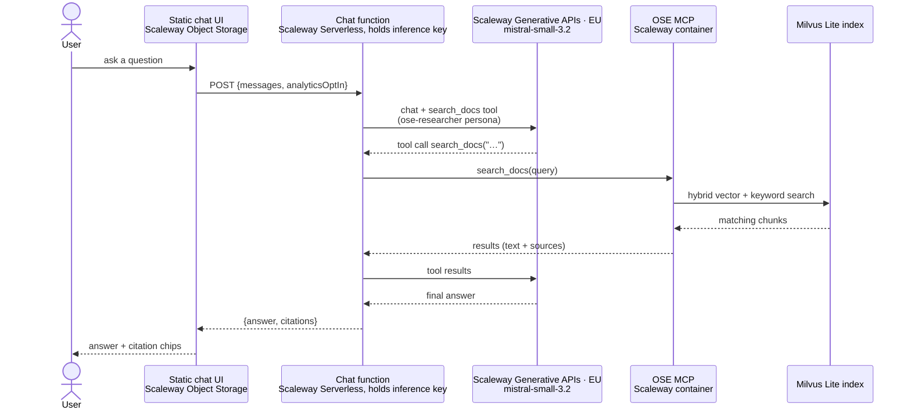
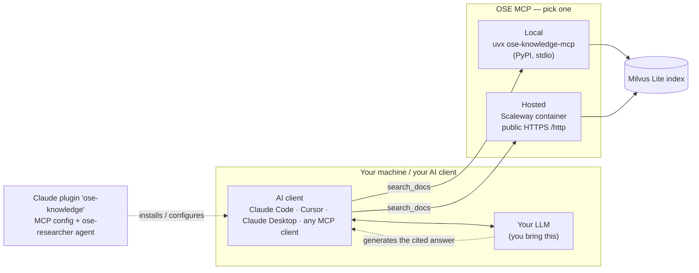

# Architecture

There is **one core product — the documentation MCP server** — and an **optional public chat**
layered on top. The RAG (retrieval) lives entirely in the MCP; answer *generation* is done by
whatever LLM the consumer brings. The chat website is just one such consumer that we host.

## Components

| Component | Path | Role |
|---|---|---|
| **OpenCrane MCP server** | `.opencrane/` | The RAG. Indexes the OSE docs into Milvus Lite and exposes the `search_docs` tool over MCP. Shipped two ways: a public Scaleway container, **and** the `ose-knowledge-mcp` PyPI package (runs locally via `uvx`). |
| **Claude plugin** | `plugins/ose-knowledge/` | Registers the MCP + an `ose-researcher` agent for Claude Code. |
| **Chat website** *(optional)* | `chat/` + `function/` | A static page (Scaleway Object Storage) + a stateless function (Scaleway Serverless) that runs the agent loop with EU-hosted inference (Mistral Small on Scaleway Generative APIs). **The only part that calls an LLM or holds a key.** |

Two ways to consume the knowledge base, below.

## Flow 1 — Public chat website

We provide the model (Mistral Small on Scaleway, EU) and the orchestration, so a visitor needs **zero setup**.
Everything in the request path is EU-hosted (sovereign).

The loop (tool call → MCP → results → continue) can repeat up to `MAX_TOOL_ROUNDS`. The function
holds the inference key, enforces the origin allowlist, and builds each citation from the
`search_docs` result — linking to the exact section (`source_url#section_anchor`) when opencrane
supplies one, else the page.
Nothing is persisted; opt-in analytics logs only the anonymized question to Scaleway Cockpit.

## Flow 2 — Your own agent (local or any MCP client)

You bring your own model and client; you consume **only** the `search_docs` retrieval tool.
**No hosted model, no chat function, no website involved.**

The Claude plugin is just a convenience that pre-wires the MCP connection and ships the
`ose-researcher` persona; pointing any MCP client at `uvx ose-knowledge-mcp` (local) or the
hosted endpoint works the same way.

## Why it's split this way

- **Retrieval vs generation.** The MCP only *retrieves* (`search_docs` over Milvus). Generating a
  cited answer needs an LLM + a tool-calling loop — that runs in the consumer (the chat function,
  or your own agent), never in the MCP.
- **The chat function is thin and optional.** It exists only because a *public, static* website
  cannot hold an API key or run the agent loop itself. Drop `chat/` + `function/` and the product
  is still complete: MCP + plugin + PyPI package.
- **One release run ships all tracks:** merging the release PR runs `release.yml`, which in the
  same run publishes the `ose-knowledge-mcp` PyPI package, deploys the hosted MCP container, and
  redeploys the chat function + page — each as a downstream job gated on release-please's
  `releases_created` output. `deploy-chat.yml` / `deploy-function.yml` remain reusable workflows that
  can also be run on their own.
